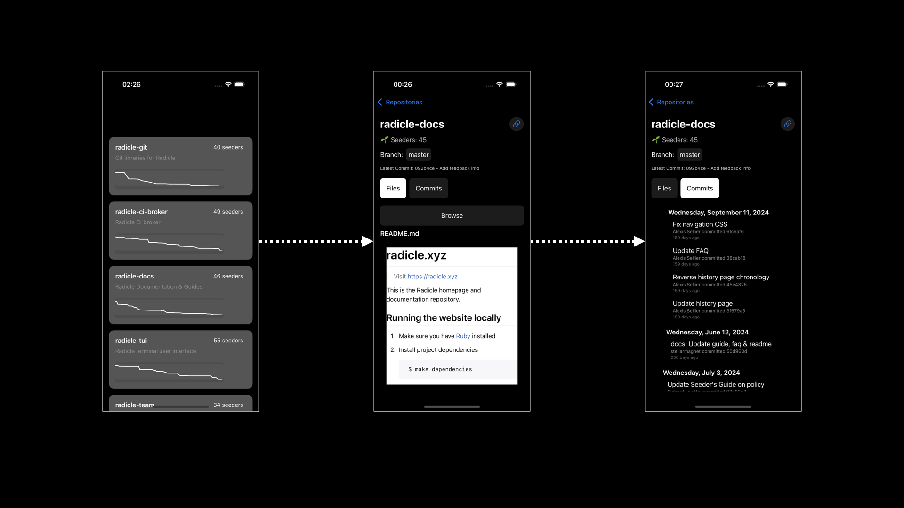

# **RadicleApp – iOS Application**

Welcome to **RadicleApp**, an iOS application that integrates with **Heartwood**, an open-source Rust-based Git protocol, to enable P2P code collaboration on iOS.

No proper build or release to the App Store...yet.

---

## **📌 Project Overview**
This repository contains:
- A **Swift-based iOS application** with UI and networking components.
- **Heartwood**, a Rust-based Git protocol integrated as a submodule.
- A build system that compiles Rust into an `.xcframework` for use in Swift.


Building locally it looks like below, pulling real data from the API endpoints:




---

## But...why?!?

This project is meant as a fun test to see what is possible for mobile devices.

My underlying hypothesis is that by allowing passive seeding of repositories on mobile devices, the network might be more resilient.

---

## **📂 Project Structure**
```
📂 RadicleApp
 ┣ 📂 API/              # Handles API calls (Repositories, Commits, Files, Issues)
 ┣ 📂 Models/           # Swift models representing data structures
 ┣ 📂 ViewModels/       # Business logic for SwiftUI Views
 ┣ 📂 Views/            # SwiftUI UI components
 ┣ 📂 Utils/            # Utility functions (caching, formatting, etc.)
 ┣ 📂 Navigation/       # App navigation & routing
 ┣ 📂 RustCore/         # Rust integration layer
 ┃ ┣ 📂 Heartwood/      # (Git Submodule) Heartwood's Rust source
 ┃ ┃ ┣ 📂 ios-bridge/   # Rust-to-iOS bridge for FFI integration
 ┃ ┃ ┃ ┣ 📜 Cargo.toml  # Rust package manifest for the iOS bridge
 ┃ ┃ ┃ ┣ 📜 build_ios.sh # Script to build Rust into an XCFramework
 ┃ ┃ ┃ ┣ 📂 include/     # Header files for Swift interoperability
 ┃ ┃ ┃ ┗ 📂 build/ios/  # Compiled `Heartwood.xcframework`
 ┣ 📜 RadicleCloneApp.swift  # Entry point of the iOS app
 ┣ 📜 ContentView.swift      # Main UI View
 ┣ 📜 Info.plist             # iOS app metadata
 ┗ 📜 Assets.xcassets        # App icons and assets
```

---

## **⚙️ Setting Up the Project**

### **1️⃣ Clone the Repository**
Since **Heartwood is a Git submodule**, you need to initialize it when cloning the repo:
```bash
git clone --recurse-submodules https://github.com/bordumb/RadicleApp.git
```
If you already cloned the repo without submodules, run:
```bash
git submodule update --init --recursive
```

### **2️⃣ Install Dependencies**
Ensure you have **Rust**, **Cargo**, and the required iOS targets:
```bash
rustup update
rustup target add aarch64-apple-ios x86_64-apple-ios aarch64-apple-ios-sim
```

### **3️⃣ Build the Rust Library for iOS**
Compile the **Heartwood Rust library** into an `.xcframework`:
```bash
sh RustCore/Heartwood/build_ios.sh
```
Expected output:
```
📦 Creating XCFramework...
✅ XCFramework created at: RustCore/Heartwood/ios-bridge/build/ios/Heartwood.xcframework
```

---

## **🔗 Integrating Rust with Xcode**
### **1️⃣ Add `Heartwood.xcframework` to Xcode**
1. Open **Xcode**.
2. Drag & drop:
   ```
   RustCore/Heartwood/ios-bridge/build/ios/Heartwood.xcframework
   ```
   into **Frameworks, Libraries, and Embedded Content**.
3. Set **"Embed"** to **"Do Not Embed"** (since it’s a static library).

### **2️⃣ Set Library Search Paths**
1. Go to **Xcode → Target → Build Settings**.
2. Search for **"Library Search Paths"**.
3. Add:
   ```
   $(PROJECT_DIR)/RustCore/Heartwood/ios-bridge/build/ios/
   ```
4. Set it to **recursive**.

### **3️⃣ Call Rust Code from Swift**
Create a Swift wrapper to call Rust functions:
```swift
import Foundation

class RustInterop {
    static func testRust() {
        hw_hello_world()
    }
}
```
Modify `ContentView.swift` to call Rust:
```swift
import SwiftUI

struct ContentView: View {
    var body: some View {
        VStack {
            Text("Hello, Radicle!")
                .padding()
            Button("Test Rust Function") {
                RustInterop.testRust()
            }
        }
    }
}
```

Run the app, press the button, and check **Xcode Console (`Cmd+Shift+C`)**:
```
Hello from Rust!
```

---

## **📦 Updating Heartwood**
Since Heartwood is an **external library**, you may want to pull new updates.

### **1️⃣ Fetch the Latest Version**
```bash
cd RustCore/Heartwood
git checkout main
git pull origin main
cd ../..
git add RustCore/Heartwood
git commit -m "Updated Heartwood to latest version"
```

### **2️⃣ Rebuild the XCFramework**
```bash
sh RustCore/Heartwood/build_ios.sh
```
Then re-run the iOS app in Xcode.

---

## **🚀 Summary**
| **Step** | **Action** |
|------|------------|
| **1. Clone repo & submodule** | `git clone --recurse-submodules` |
| **2. Install Rust dependencies** | `rustup target add aarch64-apple-ios` |
| **3. Build Heartwood for iOS** | `sh RustCore/Heartwood/build_ios.sh` |
| **4. Add `Heartwood.xcframework` to Xcode** | Drag into Frameworks & Libraries |
| **5. Set Library Search Path** | `$(PROJECT_DIR)/RustCore/Heartwood/ios-bridge/build/ios/` |
| **6. Call Rust in Swift** | `RustInterop.testRust()` |
| **7. Update Heartwood** | `git pull && sh build_ios.sh` |

🚀 **Now you’re ready to develop with Radicle + Rust on iOS!** 🎉
