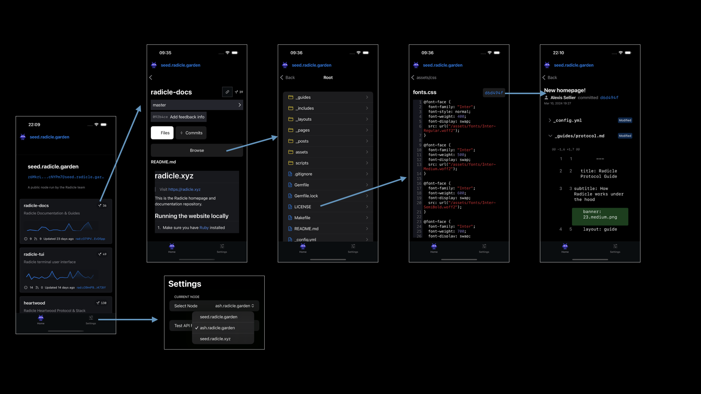

# RadicleApp
iOS app for interacting with Radicle repositories.

No proper build or release to the App Store...yet.

Building locally it looks like below, pulling real data from the API endpoints:

